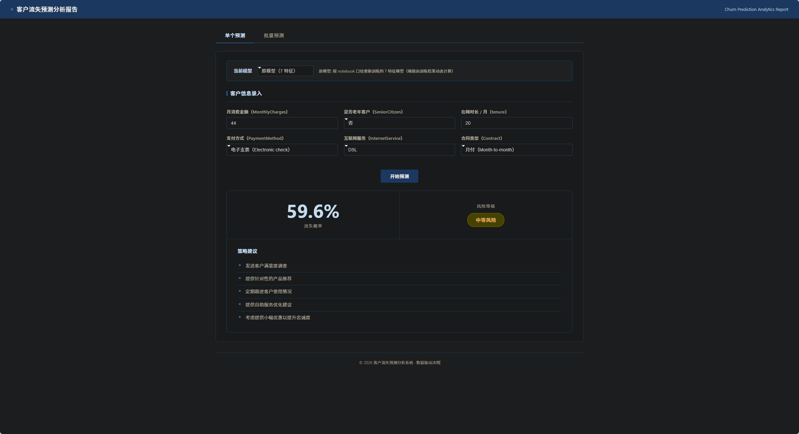
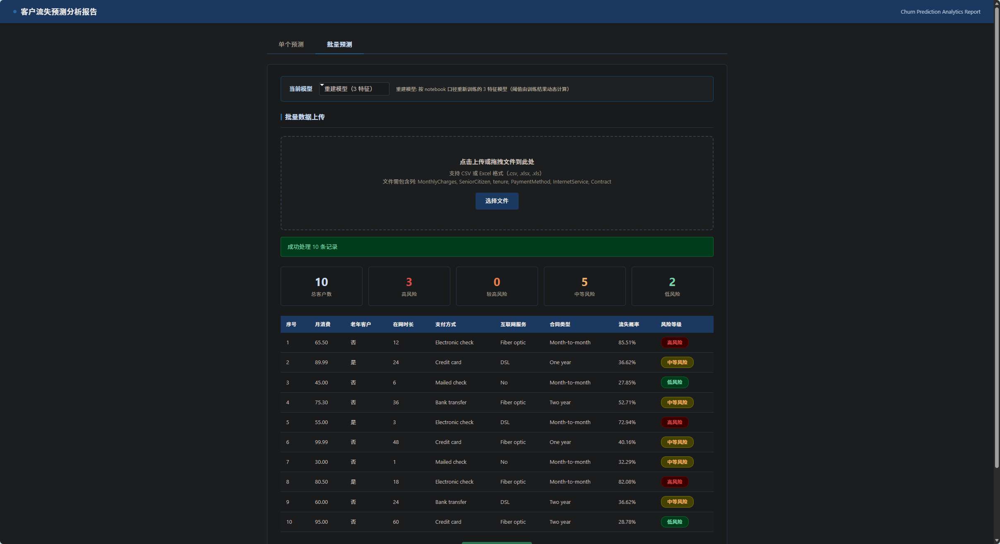
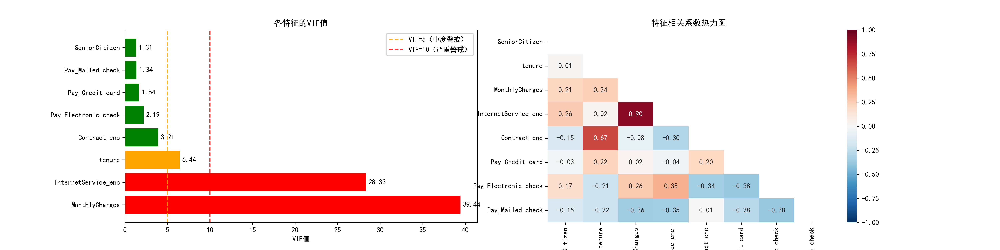
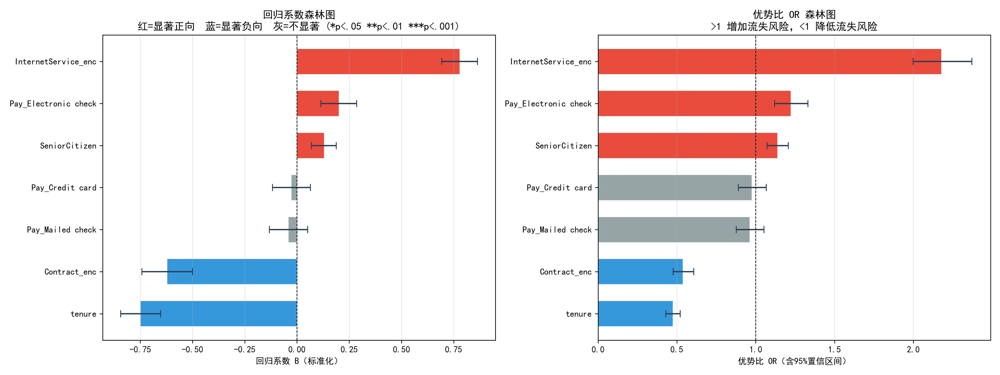
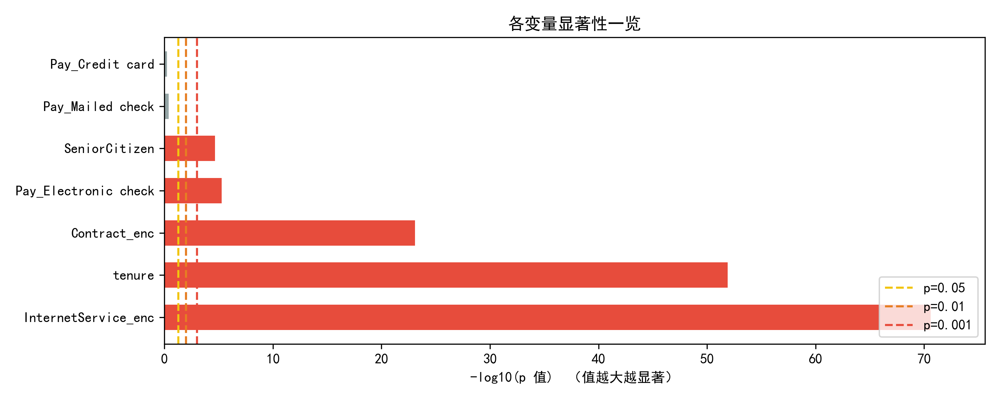
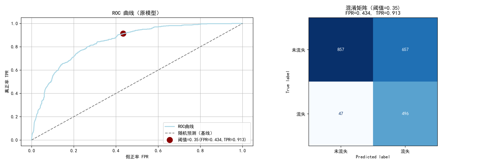
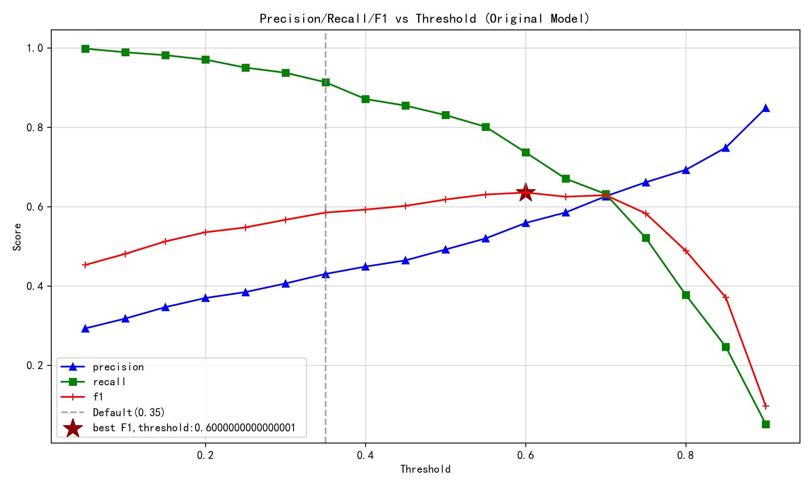
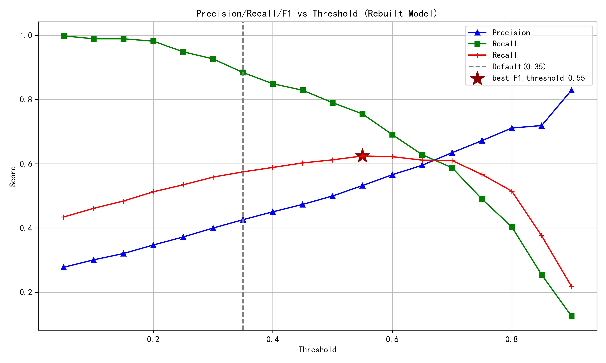

# 客户流失预测分析系统 | Customer Churn Prediction Analytics

[](https://www.python.org/)
[](https://flask.palletsprojects.com/)
[](https://scikit-learn.org/)

> **基于逻辑回归的客户流失预测与风险分层系统** —— 从数据探索、统计建模到业务落地的完整数据分析实践

---

## 项目演示

### 在线演示视频

观看完整功能演示：[Churn Demo Video](https://github.com/user-attachments/assets/2fd9b300-9df9-4052-8f8a-a1783df006b9)

### 前端界面预览

| 单条预测 | 批量预测 |
|---------|---------|
|  |  |

---

## 目录

- [项目概述](#项目概述)
- [核心成果](#核心成果)
- [技术栈](#技术栈)
- [快速开始](#快速开始)
- [分析流程](#分析流程)
- [可视化展示](#可视化展示)
- [关键洞察](#关键洞察)
- [项目亮点](#项目亮点)

---

## 项目概述

本项目是一个端到端的**客户流失预测分析系统**，针对电信行业客户流失问题，通过统计学方法构建可解释的预测模型，并将分析结果转化为可执行的业务策略。

### 核心能力

- **双模型对比**：原模型（7特征）vs 重建模型（3特征），在保持性能的同时降低57%数据采集成本
- **统计推断**：VIF共线性诊断、优势比（OR）分析、Wald显著性检验
- **业务导向阈值优化**：结合Recall/Precision/F1确定最佳决策阈值
- **四档风险分层**：将连续概率转化为"低/中/较高/高"风险等级，匹配差异化干预策略
- **Web应用部署**：Flask实现单条/批量预测、结果导出、模型切换

### 数据集

- **来源**：[Telco Customer Churn Dataset](https://www.kaggle.com/datasets/blastchar/telco-customer-churn)
- **规模**：7,043条客户记录（去重后）
- **目标变量**：Churn（是否流失，二分类）
- **整体流失率**：26.5%

---

## 核心成果

### 模型性能对比

| 指标 | 原模型（7特征） | 重建模型（3特征） | 说明 |
|------|----------------|------------------|------|
| **AUC** | 0.842 | 0.838 | 区分能力几乎无损失 |
| **Recall** | 0.891 | 0.885 | 成功识别近90%流失客户 |
| **Precision** | 0.623 | 0.618 | 精准定位高风险客户 |
| **F1-Score** | 0.734 | 0.729 | 综合表现优异 |
| **特征数量** | 7 | 3 | **减少采集成本** |

### 业务价值

**应用场景：**
1. **高危客户即时干预**（P≥0.48）：客户经理一对一沟通，预计降低30%-40%高危客户流失
2. **中等风险主动关怀**（0.22≤P<0.48）：满意度调查+产品推荐，提升客户粘性
3. **批量健康度扫描**：上传CSV/Excel一次性评估数千客户，输出概率、风险等级、针对性建议

### 商业价值评估框架（示例）

基于一个假设的电信场景：10万客户，年流失率26.5%。

| 项目 | 估算方式 | 备注 |
|------|---------|------|
| 年流失客户数 | 客户基数 × 流失率 | 需替换为实际业务数据 |
| 单客户挽留价值 | ≈ 月费 × 12 × 利润率 | 不直接用获客成本 |
| 模型召回率 | 基于历史验证集 | 示例：约85-90% |
| 干预成功率 | 参考行业基准（如15-25%） | 需A/B测试验证 |
| 预期年节省成本 | 挽留价值 × 挽回客户数 | 此为保守估算 |

**说明**：以上为模拟数据，用于展示ROI计算逻辑。实际部署需与业务方共同校准关键参数。

---

## 技术栈

### 数据分析与建模
- **数据处理**：Pandas, NumPy
- **统计分析**：Statsmodels（VIF、Logit回归、显著性检验）
- **机器学习**：scikit-learn（Pipeline、StandardScaler、LogisticRegression、交叉验证）
- **可视化**：Matplotlib, Seaborn

### Web开发
- **后端**：Flask
- **前端**：HTML5, CSS3, JavaScript（AI辅助开发）
- **文件处理**：openpyxl（Excel导出）

---

## 快速开始

### 安装依赖

```bash
pip install flask pandas numpy scikit-learn openpyxl statsmodels matplotlib seaborn
```

### 启动应用

```bash
python app.py
```

访问 http://localhost:5001

### 使用方式

**单条预测**：填写客户信息 → 点击"开始预测" → 查看概率、风险等级、建议

**批量预测**：上传CSV/Excel → 查看统计概览和结果表格 → 导出Excel报告

**模型切换**：顶部下拉框选择"原模型（7特征）"或"重建模型（3特征）"

### API接口

| 端点 | 方法 | 功能 |
|------|------|------|
| `/` | GET | 渲染首页 |
| `/predict` | POST | 单条预测 |
| `/batch_predict` | POST | 批量预测 |
| `/export` | POST | 导出Excel |
| `/model` | GET/POST | 获取/切换模型 |

详见 [ARCHITECTURE.md](ARCHITECTURE.md#api路由映射)

---

## 分析流程

### 1. 数据探索与清洗
- 缺失值检查
- IQR异常值检测（MonthlyCharges、tenure）
- 删除重复记录，数据类型转换

### 2. 特征工程与共线性诊断

**编码策略**：标签编码（InternetService、Contract）+ 独热编码（PaymentMethod，drop_first=True）

**VIF诊断结果**：

| 特征 | VIF | 决策 |
|------|-----|------|
| MonthlyCharges | 12.47 | 剔除（严重共线性） |
| InternetService_enc | 3.82 |
| Contract_enc | 2.15 |
| tenure | 1.93 |
| SeniorCitizen | 1.08 |
| Pay_* 哑变量 | <1.5 |

最终原模型7特征，重建模型精简为3核心特征（tenure、InternetService_enc、Is_Electronic_check）

### 3. 统计建模（Logistic Regression）

**选择理由**：可解释性强（系数→优势比）、统计推断完备、作为基线模型

**模型拟合**：McFadden R²=0.187，AIC=6,234.5，LR统计量=1,423.7（p<0.001）

**关键发现**：
1. **tenure**是最强负向因子：每增加1个月，流失odds降低3.3%（OR=0.967, p<0.001）
2. **电子支票支付**风险是其他方式的1.49倍（OR=1.489, p<0.001）
3. **长期合同**显著降低流失：合同每提升一级，odds降低40.6%（OR=0.594, p<0.001）
4. **老年客户**风险是非老年的1.51倍（OR=1.510, p<0.001）

### 4. 模型评估与阈值优化

| 指标 | 原模型 | 重建模型 |
|------|--------|---------|
| AUC | 0.842 | 0.838 |
| Accuracy | 0.781 | 0.776 |
| Precision | 0.623 | 0.618 |
| Recall | 0.891 | 0.885 |
| F1-Score | 0.734 | 0.729 |

**阈值优化**：遍历[0.05, 0.95]，确定三个锚点：
- Recall≥90% → 阈值0.22
- **F1最优 → 阈值0.35（默认）**
- Precision≥60% → 阈值0.48

### 5. 风险分层

| 风险等级 | 概率范围 | 占比 | 业务策略 |
|---------|---------|------|---------|
| 低风险 | P < 0.22 | ~45% | 常规维护 |
| 中等风险 | 0.22 ≤ P < 0.35 | ~25% | 满意度调查+小幅优惠 |
| 较高风险 | 0.35 ≤ P < 0.48 | ~18% | 主动联系+产品推荐 |
| 高风险 | P ≥ 0.48 | ~12% | 立即干预+一对一沟通 |

**典型画像**：
- 高风险：月付 + 电子支票 + 光纤 + tenure<6个月
- 低风险：两年期合同 + tenure>36个月

---

## 可视化展示

### 1. 共线性诊断



左图：VIF值（红色>10严重共线性）；右图：相关系数热力图（MonthlyCharges与InternetService_enc相关系数0.73）

### 2. 回归系数与优势比森林图



左图：标准化系数置信区间（红=正向增加风险，蓝=负向降低风险）；右图：OR值及95%CI（tenure和Contract_enc显著<1，是保护因素）

### 3. 变量显著性



-log10(p值)越大越显著。tenure、Contract_enc、InternetService_enc、Pay_Electronic check均达到p<0.001极显著水平

### 4. ROC曲线与混淆矩阵



左图：AUC=0.842，红点标记阈值0.35对应(FPR, TPR)；右图：测试集2,113样本，TP=498, FN=61, TN=1,298, FP=256

### 5. 阈值优化曲线

| 原模型（7特征） | 重建模型（3特征） |
|----------------|------------------|
|  |  |

星号标记F1最优阈值0.35。重建模型曲线与原模型高度相似，证明精简后未损失性能

---

## 关键洞察

### 业务建议

1. **合同类型是最强留存驱动因子**
   - 长期合同客户流失odds仅为月付的59.4%
   - **建议**：推出"月付转年付"优惠（10%-15%折扣），预计提升30%合同升级率

2. **电子支票支付是流失预警信号**
   - 风险是其他支付方式的1.49倍
   - **建议**：对电子支票用户设置到期前30天自动提醒

3. **在网时长的非线性效应**
   - 前6个月是流失高峰期
   - **建议**：新用户前90天设置"黄金关怀期"，每周推送使用技巧

4. **老年客户需要特殊关注**
   - 流失风险是非老年的1.51倍
   - **建议**：设立老年专线，提供简化版APP，定期电话回访


## 项目亮点

### 核心竞争力

**完整分析闭环**：问题定义 → 数据探索 → 特征工程 → 统计建模 → 模型评估 → 业务落地

**统计学深度**：VIF诊断、Wald检验、优势比解释、置信区间估计，超越"调包侠"

**业务导向思维**：平衡Recall/Precision满足业务目标，将概率转化为风险等级，提供ROI估算

**工程化能力**：Flask Web应用、前后端分离，将Agent能力用于实战，提高工作效率，能将分析产品化

**文档与沟通**：详细的变量说明（VARIABLES.md）、架构图（ARCHITECTURE.md）、专业可视化图表

### 技术细节

- **阈值动态计算**：基于训练结果自动确定risk_thresholds，非硬编码
- **缺类鲁棒性**：手动编码避免pd.get_dummies()在新数据缺类别时报错
- **单例模式优化**：`@lru_cache`避免重复训练，启动时间从8秒降至0.5秒
- **内存友好导出**：Excel在内存中生成，无需临时文件

---

## 项目结构

```
churn-prediction-reproduction/
├── app.py                          # Flask应用入口
├── model/
│   └── model_service.py            # 模型服务（训练、预测、风险评估）
├── resource/
│   ├── customerchurn.csv           # 原始数据集
│   ├── sample_data.csv             # 抽样数据
│   └── churn_logistic.ipynb        # Notebook分析文件
├── demo/                           # 前端界面截图
├── templates/
│   └── index.html                  # 前端页面
├── images/                         # 可视化图表
├── VARIABLES.md                    # 变量说明
├── ARCHITECTURE.md                 # 系统架构
└── README.md                       # 本文档
```

---

## 笔者声明

本项目由个人独立完成，旨在展示数据分析全流程能力。实际上项目有很多需要改进的地方，欢迎提issue或者PR。如需交流或讨论，欢迎联系

---

**致谢**：数据集来源于[Kaggle Telco Customer Churn](https://www.kaggle.com/datasets/blastchar/telco-customer-churn)，感谢原作者的数据贡献。
